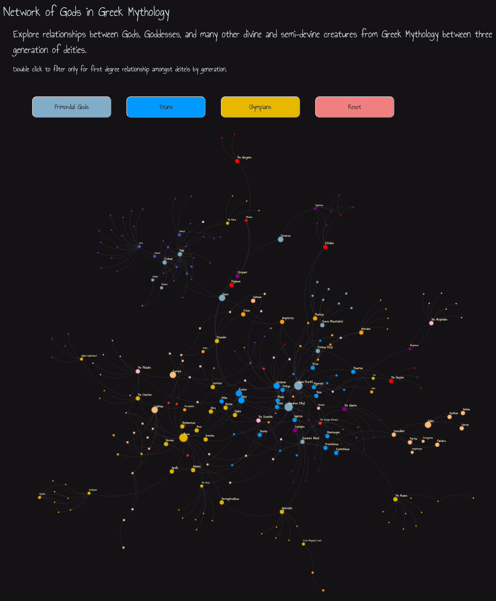
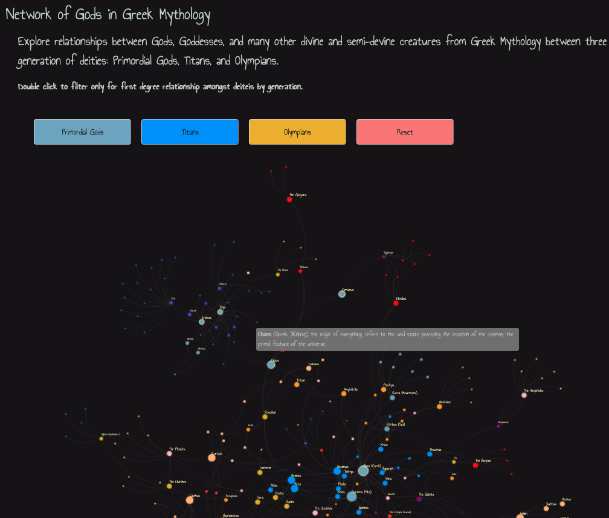

# Genealogy Network of Gods in Greek Mythology

An interactive D3.js dynamic force-directed graph of gods in Greek mythology.

## Table of Contents

1. [Introduction](#Intro)
2. [Data Gathering](#Data-Gathering)
3. [Visualisation](#Visualisation)
    1. [Data Preparation](#Data-Preparation)
    2. [D3-Force Layout](#D3-force)
    3. [Links and Nodes Adjustments](#Links-and-Nodes)
    4. [Filtering Gods by Mythological Group](#Filtering)

## 1. Introduction

This project was inspired whilst reading the excellent book [*Mythos* by Steven Fry](https://www.waterstones.com/book/mythos/stephen-fry/9781405934138) that is humorously recounting the Greek myths. Although some family trees showing the connections of gods of a generation are included in the book, the striking number of deities and their perplexed relationships in Greek mythology can be too chaotic to follow. This triggered my interest in creating a visualisation that would depict the whole genealogy network starting from the first generation of cosmological abstract concepts (*Chaos, Space, Light*) to the Olympians following the book's chronological order.

## 2. Data Gathering

The toughest challenge in creating this visualisation was the data collection. Data was gathered by manually going through the book, marking any parent-child connection, and entering it into CSV format.
The excellent [*Theoi Project*](https://www.theoi.com/) and information retrieved from [Wikipedia](https://en.wikipedia.org/wiki/Main_Page) were used as additional data sources for cross-checking and expanding the network. 

Links of acquaintances were not included in the graph as the main goal of this project was to depict the genealogy of the gods. However, information on interactions between the gods was recorded alongside with other interesting facts about the myths they were involved and provided through the brief description available when hovering over each god node.

Note: The parent-child relationships and information of certain myths might vary depending on the source. The present visualisation depicts the Greek myths as described in Fry's book that it is mainly based on [Hesiod's version](https://en.wikipedia.org/wiki/Theogony).

## 3. Visualisation

The visualisation was created using [D3.js framework](https://d3js.org/) (D3 V4). The network graph is a combination of D3's creator Mike Bostock's [Force-Directed Graph](https://observablehq.com/@d3/force-directed-graph) and [Curved Links](https://bl.ocks.org/mbostock/4600693).  Gods are depicted as nodes in a force-directed graph layout utilising [D3-force package](https://www.d3indepth.com/force-layout/). In addition, Denise Mauldin's [Filtering Nodes on Force-Directed Graphs](https://bl.ocks.org/denisemauldin/cdd667cbaf7b45d600a634c8ae32fae5) demonstration was followed to add buttons that would filter the network for certain mythological groups of gods.

### 3.1 Data Preparation
[D3's force layout](https://www.d3indepth.com/force-layout/) requires information on **nodes** and **links** (data elements); nodes are mapped to SVG circle elements and relate to each other through links that are mapped to SVG line elements. The details on nodes and links that was necessary to create our netowork of gods was stored in JSON format following Mike Bostock's paradigm; the data collected on the relationships of creatures in Greek mythology, retrieved from Fry's book and Theoi project, was transformed to JSON format to map Bostock's implementation of force-directed graph.

### 3.2 D3-force layout

D3's force layout uses the [forceSimulation API](https://github.com/d3/d3-force#simulation) that applies physics based simulator for positioning visual elements. It provides functions (`forces`) that allows us to control the position or velocities of nodes in relation to each other. In the present visualisation, simulation composed of the following `forces`:
-  `charge` to define how nodes repel one another; here `forceManyBody()` used with a negative value causing the nodes to repel one another like like electrostatic charge
- `link` for defining the distance and strength parameters for each edge
- `middle`, `bottom` for creating a new positioning force along the x and y axis
- `collision` for avoiding overlapping by treating nodes as circles with radius

Initially, using `forceManyBody()` default values and positioning the graph on the center of the SVG, the network looked as showed in Figure 1 below.

|  |
|:--:|
| *Figure 1: First Version of the Graph.* |

### 3.3 Links and Nodes Adjustments

To improve the aesthetics of the graph, edges were changed to curved lines following the same approach described in the [Curved Links example by Mike Bostock](https://bl.ocks.org/mbostock/4600693). Furthermore, the major characters were highlighted by increasing their node size whilst titles were removed from minor deities like *daimones* and *nymphs* (see Figure 2). 

|  |
|:--:|
| *Figure 2: Graph with Links Curved.* |

Moreover, through drag and drop, and mouseover events to links and nodes user interactivity was achieved. In the definition of the nodes, `.call(force.drag);`  function was utilised to add a force drag event to the specified node. Moreover, a `tooltip` was created, including the `mouseover` event, to reveal a short description when hovering over a node. Finally, a functionality that enables the highlight of the connections of a selected node was included in the `mouseover` event by filtering the 'target' nodes.

### 4. Filtering Gods by Mythological Group
An additional functionality to filter nodes and their respective links based on the deities group they belong was added to the visual to enable the user explore the network for different categories, namely, *Primordial Gods*, *Titans*, and *Olympians* gods. The filtering was based on [Denise Mauldin's post](https://bl.ocks.org/denisemauldin/cdd667cbaf7b45d600a634c8ae32fae5#index.html) on filtering nodes on Force-Directed Graphs following the [*General Update Pattern*](https://bl.ocks.org/mbostock/3808218). In the following figure (Figure 3), we can see as an example how using the filtering button on *'12 Olympians'* the network is adjusted to only show the connections between the Olympian entities (Zeus, Artemis, Ares, Apollo, Athena ... ).

|  |
|:--:|
| *Figure 3: Graph with Filter Buttons.* |

## Styling & Visual Design

The appearance of the visualisation was enhanced using some simple CSS. A screenshot of the final version of the network of gods is shown in Figure 4. 

|  |
|:--:|
| *Figure 3: Graph with Styling.* |

## Resources

Here is a list of some of the sources consulted to create the present visualisation:

- [Theoi Project](https://www.theoi.com/)
- [GreekMythology.com](https://www.greekmythology.com/)
- [D3 in Depth - Force Layout](https://www.d3indepth.com/force-layout/)
- [Creating force layout graphs in d3](https://www.pluralsight.com/guides/creating-force-layout-graphs-in-d3)
- [Simple d3.js tooltips](https://bl.ocks.org/d3noob/a22c42db65eb00d4e369)
- [Filtering Nodes on Force-Directed Graphs](https://bl.ocks.org/denisemauldin/cdd667cbaf7b45d600a634c8ae32fae5#index.html)
- [Glow filter](https://stackoverflow.com/questions/9630008/how-can-i-create-a-glow-around-a-rectangle-with-svg)

## Licence
